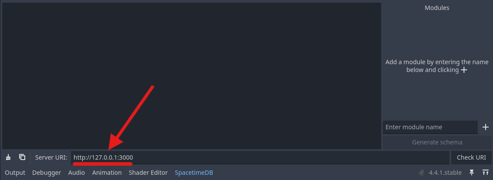
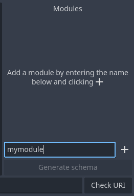

# SpacetimeDB Bindings Generation

## Prerequisites

-   You have the [SpacetimeDB SDK addon](installation.md) installed in your Godot project
-   A SpacetimeDB module published to a SpacetimeDB server  
    _The codegen tool uses the SpacetimeDB API to generate all types and reducers_

> Note: Every table in your SpacetimeDB module must have a primary key for the local database and deserialization to work correctly.

## Generate module bindings

1. Open the SpacetimeDB tab in the bottom dock
2. Replace the default URL with your server’s URL  
   
3. Click "Check URI" to verify the addon can reach your server
4. Enter your module name and click the `+` button  
   
5. You can now click the `Generate schema` button to generate the bindings, all generated code is placed in `res://spacetime_bindings/`

## Generated bindings structure

The generated bindings are placed in `res://spacetime_bindings/` and are structured as follows:

-   `codegen_debug` contains the parsed SpacetimeDB schema for debugging purposes, you can delete this folder if you want.
-   `schema` contains all of the generated bindings for your SpacetimeDB module.
    -   `schema/types` and `schema/module_*_types.gd` contains all of your SpacetimeDB types, table structs and enums, these are using by the BSATN deserializer.
    -   `schema/tables` and `schema/module_*_db.gd` contains the a representation of your module's tables allowing you to easily query the local database.
    -   `schema/module_*_reducers.gd` contains all of the reducer functions for your module.
    -   `schema/module_*_client.gd` is the spacetimedb client for your module which handles the SpacetimeDB connection and exposes the database and reducers.
-   `codegen_config.json` contains the configuration for codegen, modify this file to change what code is generated.
-   `codegen_data.json` the saved state of the plugin UI, do not edit this file directly.

---

### Continue reading

-   [Quick Start](quickstart.md)
-   [API Reference](api.md)
